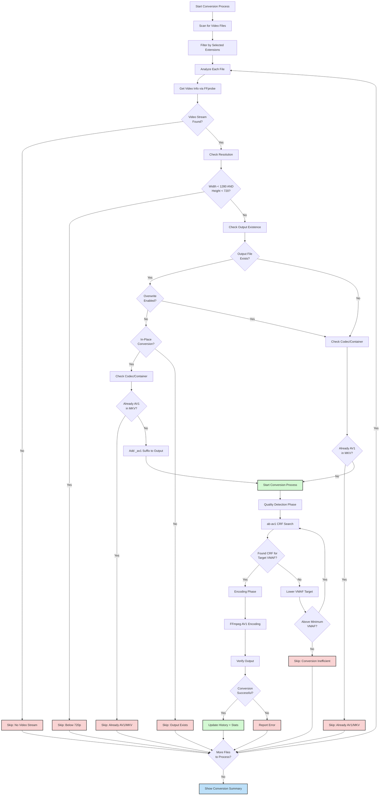

# AV1 Video Converter

This application provides a simple graphical interface (GUI) for converting your video files to the modern, high-efficiency AV1 codec. It uses the excellent `ab-av1` tool to automatically optimize encoding settings based on visual quality (VMAF), making high-quality AV1 conversion accessible without needing complex command-line knowledge.

## Key Features

*   **Easy-to-Use Interface:** Select input and output folders, adjust basic settings, and start converting with just a few clicks.
*   **Automatic Quality Control (VMAF):** Instead of guessing bitrates, the converter targets a specific visual quality level (VMAF score, default 95) ensuring consistent results across different videos.
*   **Batch Conversion:** Automatically finds and converts supported video files (`.mp4`, `.mkv`, `.avi`, `.wmv`) within your chosen input folder and its subdirectories.
*   **Progress Tracking:** Monitor the overall batch progress and see details for the currently converting file, including quality detection and encoding phases, plus estimated time remaining.
*   **Reliable MKV Output:** Converts videos into the flexible MKV container format.
    *   *Note:* If converting an MKV file that isn't already AV1, and you are outputting to the *same folder* without enabling 'Overwrite', a suffix ` (av1)` will be added to the output filename to avoid replacing the original.

## Important Note on `ab-av1.exe`

This project relies on the external command-line tool `ab-av1.exe`. While a version might be bundled for convenience, **it is strongly recommended for security and compatibility that you download the latest official `ab-av1.exe` executable yourself** from its official source (e.g., the `ab-av1` GitHub releases page).

Place the downloaded `ab-av1.exe` inside the `src/` directory of this project, replacing any existing file.

## Requirements

*   **Python:** Version 3.6 or higher.
*   **FFmpeg:** Must be installed and available in your system's PATH. Requires a version with `libsvtav1` (SVT-AV1 encoder) support. You can download builds from [ffmpeg.org](https://ffmpeg.org/download.html) or [Gyan.dev](https://www.gyan.dev/ffmpeg/builds/) (for Windows).
*   **ab-av1:** The `ab-av1.exe` executable (see note above).

## Installation & Setup

1.  **Install Dependencies:** Ensure you have Python and FFmpeg installed (and FFmpeg is in your system's PATH).
2.  **Get `ab-av1.exe`:** Download the executable and place it in the `src/` directory (see important note above).
3.  **Run the Application:**
    *   **Windows:** Double-click `convert.bat`.
    *   **Other Platforms (Linux/macOS):** Open a terminal in the project's root directory and run:
        ```bash
        python -m src.convert
        ```
        *(Note: The `convert.bat` file simply runs the `python -m src.convert` command for you)*.

## How to Use

1.  **Launch:** Start the application using the methods above.
2.  **Select Folders:**
    *   Click "Browse..." for "Input Folder" to choose where your original videos are.
    *   Click "Browse..." for "Output Folder" to choose where the converted `.mkv` files will be saved. (Defaults to the input folder if left blank).
3.  **Adjust Settings (Optional):**
    *   Go to the "Settings" tab to configure options like overwriting existing files, audio handling, and file types to process.
4.  **Start:** Go back to the "Convert" tab and click "Start Conversion".
5.  **Monitor:** Watch the progress bars and status messages.
6.  **Done!** A summary message will appear upon completion. Check your output folder.

## Conversion Process Flow

The following diagram shows the decision-making process for each video file:



---

*For detailed technical documentation, see `llm.md`.*