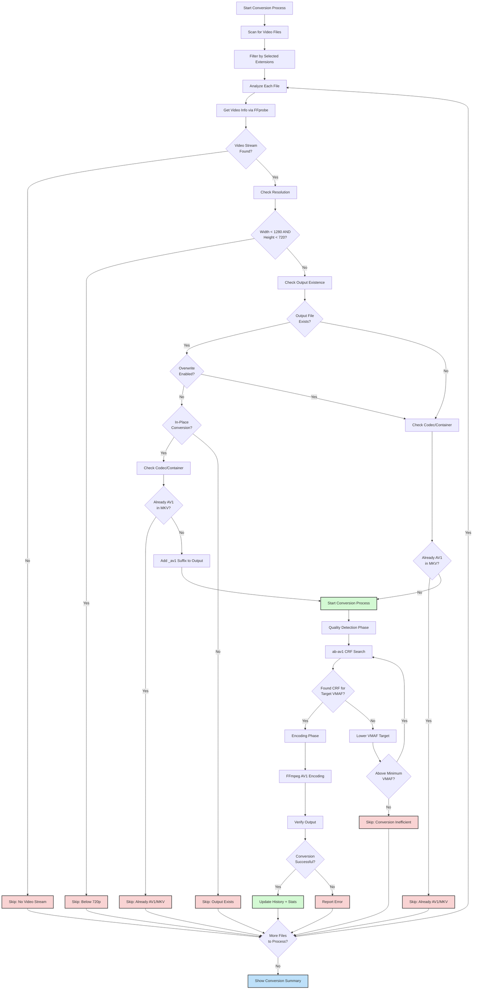

# Architecture

Technical documentation for the Auto-AV1-Converter.

## Conversion Process Flow

The following diagram shows the decision-making process for each video file:



## Two-Phase Encoding

ab-av1 performs conversion in two distinct phases:

### Phase 1: Quality Detection (CRF Search)
- Samples the video at various CRF values
- Calculates VMAF score for each sample
- Binary search to find CRF that meets target VMAF (default: 95)
- Output: Optimal CRF value

### Phase 2: Encoding
- FFmpeg encodes the full video using the discovered CRF
- Uses SVT-AV1 encoder (`libsvtav1`)
- Output: Final `.mkv` file

### VMAF Fallback

If the target VMAF is unattainable (e.g., source quality too low):
1. Decrement target by 1 (configurable via `VMAF_FALLBACK_STEP`)
2. Retry CRF search
3. Repeat until `MIN_VMAF_FALLBACK_TARGET` (default: 90) reached
4. If still failing, skip file as "conversion not worthwhile"

## Queue System

Conversion uses a queue-based architecture rather than direct folder scanning:

1. **Analysis Tab**: Browse folders, run ffprobe scans, preview estimates
2. **Add to Queue**: Select files/folders and add with operation type
3. **Queue Processing**: Worker thread processes queue items sequentially

### Operation Types

| Type | Action | Output |
|------|--------|--------|
| `CONVERT` | Full encoding (CRF search + encode) | Video file |
| `ANALYZE` | CRF search only | Updates history cache |

### Queue Item States

`PENDING` → `CONVERTING` → `COMPLETED` / `ERROR` / `STOPPED`

## Threading Model

```
┌─────────────────────────────────────────────────────────┐
│                    Main Thread                          │
│  ┌───────────────────────────────────────────────────┐  │
│  │              Tkinter Event Loop                   │  │
│  │  - GUI rendering                                  │  │
│  │  - User input handling                            │  │
│  │  - Scheduled callbacks via root.after()           │  │
│  └───────────────────────────────────────────────────┘  │
└─────────────────────────────────────────────────────────┘
              ▲                              ▲
              │ update_ui_safely()           │ update_ui_safely()
              │                              │
┌─────────────────────────────┐  ┌───────────────────────────────┐
│      Worker Thread          │  │    Analysis Threads           │
│  ┌───────────────────────┐  │  │  ┌─────────────────────────┐  │
│  │ sequential_conversion │  │  │  │   ThreadPoolExecutor    │  │
│  │      _worker()        │  │  │  │   (4-8 workers)         │  │
│  │  - Queue processing   │  │  │  │  - Parallel ffprobe     │  │
│  │  - Conversion/analyze │  │  │  │  - Folder scanning      │  │
│  │  - Progress callbacks │  │  │  │  - Metadata extraction  │  │
│  └───────────────────────┘  │  │  └─────────────────────────┘  │
│            │                │  └───────────────────────────────┘
│            ▼                │
│  ┌───────────────────────┐  │
│  │   subprocess.Popen    │  │
│  │  - ab-av1 execution   │  │
│  │  - stdout/stderr pipe │  │
│  │  - Line-by-line parse │  │
│  └───────────────────────┘  │
└─────────────────────────────┘
```

## Data Flow

### Conversion Start
1. User clicks "Start" → `conversion_controller.start_conversion()`
2. Validate queue has pending items
3. Enable sleep prevention (`platform_utils.prevent_sleep_mode`)
4. Launch worker thread with queue configuration

### Worker Loop
1. Fetch next pending queue item via callback
2. For folder items: scan for video files matching extensions
3. For each file in item:
   - Check resolution, codec, output existence
   - Call `video_conversion.process_video()` (CONVERT) or `wrapper.crf_search()` (ANALYZE)
   - Dispatch progress via callbacks
   - Update history on completion
4. Update queue item status (COMPLETED/ERROR)

### Callback Chain
```
AbAv1Wrapper.auto_encode()
  → parser.parse_line()           # Regex parsing of stdout
  → file_callback_dispatcher()    # Route by status type
  → handle_* functions            # Update state
  → gui_updates.* functions       # Prepare UI changes
  → update_ui_safely()            # Schedule on main thread
  → root.after(0, callback)       # Execute in Tkinter loop
```

## Subprocess Management

### ab-av1 Execution
```python
process = subprocess.Popen(
    cmd,
    stdout=subprocess.PIPE,
    stderr=subprocess.STDOUT,
    encoding='utf-8',
    errors='replace',
    env=process_env  # Includes verbosity settings
)
```

### Environment Variables
Set for maximum output verbosity:
- `RUST_LOG=trace,ab_av1=trace,ffmpeg=trace`
- `AV1_PRINT_FFMPEG=1`
- `SVT_VERBOSE=1`

### Process Termination
- **Graceful stop**: Set `stop_event`, wait for current file to finish
- **Force stop**: `taskkill /T /F /PID` (Windows) or `SIGKILL` (Unix)
- PID tracked via `pid_callback` mechanism

## Output Parsing

ab-av1 wraps FFmpeg, producing different output formats per phase:

| Phase | Source | Format | Reliability |
|-------|--------|--------|-------------|
| Quality Detection | ab-av1 | `Trying crf=X.X, vmaf=Y.Y` | High |
| Encoding | FFmpeg | `frame=X fps=Y time=HH:MM:SS` | Variable (buffering) |

Parser uses multiple regex patterns to handle format variations. See `ab_av1/parser.py` for implementation.

## See Also

- [README](../README.md) - User installation and usage guide
- [agents.md](../agents.md) - Development guidelines and project structure
