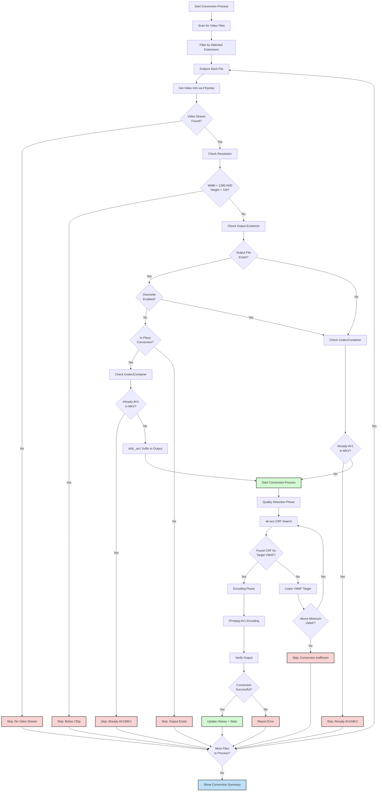

# Architecture

Technical documentation for the Auto-AV1-Converter.

## Conversion Process Flow

The following diagram shows the decision-making process for each video file:


```mermaid
flowchart TD
    Start[Start Conversion Process] --> ScanFiles[Scan for Video Files]
    ScanFiles --> Filter[Filter by Selected Extensions]
    Filter --> AnalyzeLoop[Analyze Each File]

    AnalyzeLoop --> GetInfo[Get Video Info via FFprobe]
    GetInfo --> CheckVideoStream{Video Stream<br/>Found?}

    CheckVideoStream -->|No| SkipNoVideo[Skip: No Video Stream]
    CheckVideoStream -->|Yes| CheckRes[Check Resolution]

    CheckRes --> ResolutionCheck{Width < 1280 AND<br/>Height < 720?}
    ResolutionCheck -->|Yes| SkipLowRes[Skip: Below 720p]
    ResolutionCheck -->|No| CheckOutput[Check Output Existence]

    CheckOutput --> OutputExists{Output File<br/>Exists?}
    OutputExists -->|Yes| CheckOverwrite{Overwrite<br/>Enabled?}
    CheckOverwrite -->|No| CheckInPlace{In-Place<br/>Conversion?}
    CheckOverwrite -->|Yes| CheckCodec[Check Codec/Container]

    CheckInPlace -->|Yes| CheckCodec2[Check Codec/Container]
    CheckInPlace -->|No| SkipExists[Skip: Output Exists]

    CheckCodec[Check Codec/Container] --> CheckAV1{Already AV1<br/>in MKV?}
    CheckCodec2[Check Codec/Container] --> CheckAV1_2{Already AV1<br/>in MKV?}

    CheckAV1 -->|Yes| SkipAV1[Skip: Already AV1/MKV]
    CheckAV1 -->|No| StartConversion[Start Conversion Process]

    CheckAV1_2 -->|Yes| SkipAV1_2[Skip: Already AV1/MKV]
    CheckAV1_2 -->|No| AddSuffix[Add _av1 Suffix to Output]
    AddSuffix --> StartConversion

    OutputExists -->|No| CheckCodec

    StartConversion --> QualityDetection[Quality Detection Phase]
    QualityDetection --> CRFSearch[ab-av1 CRF Search]
    CRFSearch --> VMAFTarget{Found CRF for<br/>Target VMAF?}

    VMAFTarget -->|Yes| EncodingPhase[Encoding Phase]
    VMAFTarget -->|No| LowerVMAF[Lower VMAF Target]
    LowerVMAF --> MinVMAF{Above Minimum<br/>VMAF?}
    MinVMAF -->|Yes| CRFSearch
    MinVMAF -->|No| SkipInefficient[Skip: Conversion Inefficient]

    EncodingPhase --> FFmpegEncode[FFmpeg AV1 Encoding]
    FFmpegEncode --> Verify[Verify Output]
    Verify --> Success{Conversion<br/>Successful?}

    Success -->|Yes| UpdateHistory[Update History + Stats]
    Success -->|No| ReportError[Report Error]

    UpdateHistory --> NextFile{More Files<br/>to Process?}
    ReportError --> NextFile
    SkipNoVideo --> NextFile
    SkipLowRes --> NextFile
    SkipExists --> NextFile
    SkipAV1 --> NextFile
    SkipAV1_2 --> NextFile
    SkipInefficient --> NextFile

    NextFile -->|Yes| AnalyzeLoop
    NextFile -->|No| ShowSummary[Show Conversion Summary]

    style SkipNoVideo fill:#f9d3d3,stroke:#333,stroke-width:2px
    style SkipLowRes fill:#f9d3d3,stroke:#333,stroke-width:2px
    style SkipExists fill:#f9d3d3,stroke:#333,stroke-width:2px
    style SkipAV1 fill:#f9d3d3,stroke:#333,stroke-width:2px
    style SkipAV1_2 fill:#f9d3d3,stroke:#333,stroke-width:2px
    style SkipInefficient fill:#f9d3d3,stroke:#333,stroke-width:2px
    style ReportError fill:#f9d3d3,stroke:#333,stroke-width:2px
    style UpdateHistory fill:#d3f9d3,stroke:#333,stroke-width:2px
    style ShowSummary fill:#bde0f9,stroke:#333,stroke-width:2px
    style StartConversion fill:#d3f9d3,stroke:#333,stroke-width:2px
```

## Two-Phase Encoding

ab-av1 performs conversion in two distinct phases:

### Phase 1: Quality Detection (CRF Search)
- Samples the video at various CRF values
- Calculates VMAF score for each sample
- Binary search to find CRF that meets target VMAF (default: 95)
- Output: Optimal CRF value

### Phase 2: Encoding
- FFmpeg encodes the full video using the discovered CRF
- Uses SVT-AV1 encoder (`libsvtav1`)
- Output: Final `.mkv` file

### VMAF Fallback

If the target VMAF is unattainable (e.g., source quality too low):
1. Decrement target by 1 (configurable via `VMAF_FALLBACK_STEP`)
2. Retry CRF search
3. Repeat until `MIN_VMAF_FALLBACK_TARGET` (default: 90) reached
4. If still failing, skip file as "conversion not worthwhile"

## Queue System

Conversion uses a queue-based architecture rather than direct folder scanning:

1. **Analysis Tab**: Browse folders, run ffprobe scans, preview estimates
2. **Add to Queue**: Select files/folders and add with operation type
3. **Queue Processing**: Worker thread processes queue items sequentially

### Operation Types

| Type | Action | Output |
|------|--------|--------|
| `CONVERT` | Full encoding (CRF search + encode) | Video file |
| `ANALYZE` | CRF search only | Updates history cache |

### Queue Item States

`PENDING` → `CONVERTING` → `COMPLETED` / `ERROR` / `STOPPED`

### Queue Filtering and Verdict Freshness

All queue additions funnel through `filter_file_for_queue()` (`gui/queue_manager.py`);
saved-queue reloads go through `_is_file_done_per_history()`. Both skip files with a
decided history verdict (CONVERTED / NOT_WORTHWHILE / ANALYZED-for-ANALYZE) only while
that verdict still describes the file on disk — a changed file at a known path is
re-queueable. Since no ffprobe runs on these paths (Layer-1/Layer-2 separation), the
replace-mode steady state (the AV1 output sitting at the input path with changed
stamps) is recognized by stat alone via `cache_helpers.converted_verdict_applies()`:
unchanged stamps, or a `.mkv` path whose size equals the recorded `output_size_bytes`.
See `docs/HISTORY_FORMAT.md` for the full validity rules.

### Queue Tree Updates

The queue tree (`gui/queue_tree.py`) updates incrementally so folder expand
state, selection, and scroll position survive changes:

| Change | Function | Strategy |
|--------|----------|----------|
| Status/estimate/output change | `refresh_queue_tree_values()` | Recompute values/tags of all rows in place |
| Operation type change | `update_queue_item_row()` | Recompute one item + nested file rows |
| Items added | `add_queue_items_to_tree()` | Append rows only |
| Items removed | `remove_queue_items_from_tree()` | Delete rows, renumber the rest |
| Drag-drop reorder | `sync_queue_order_from_tree()` | Renumber row text in place |
| Structural bulk (startup load, clear queue, clear completed, conflict replace) | `refresh_queue_tree()` | Full rebuild; restores folder expand state keyed by queue item id |

Row identity is tracked by stable queue-item-id → tree-iid maps
(`_queue_tree_map`, `_tree_queue_map`, plus per-file maps); the incremental
functions maintain these maps and fall back to a full rebuild if the tree
has drifted from `_queue_items`.

## History, Statistics, and Settings Tabs

### History Tab

The History tab (`gui/tabs/history_tab.py`) shows a flat list of files
processed by ab-av1, loaded from `HistoryIndex.get_by_status()` for the
CONVERTED, ANALYZED, and NOT_WORTHWHILE statuses. Filter checkboxes toggle
each status and trigger a debounced (50 ms) refresh. The tab maintains its
own tree state on the GUI object: `_history_tree_map` (path_hash → tree item
id) plus sort state (`_history_sort_col`, `_history_sort_reverse`) — clicking
a column header sorts in place with ▲/▼ indicators, parsing sizes, bitrates,
percentages, and durations back to numbers for correct ordering.
`compute_history_display_values()` formats every column for a record;
output columns (output size, reduction, VMAF, CRF) are only populated for
CONVERTED records. Right-click offers Open File / Show in Folder, suppressed
for anonymized records with no `original_path`.

### Statistics Tab

The Statistics tab (`gui/tabs/statistics_tab.py`) aggregates CONVERTED
records from `HistoryIndex.get_converted_records()` on the "Refresh
Statistics" button. It renders three canvas charts from `gui/charts.py`:
a size-reduction histogram (`BarChart`, 10% buckets), a source-codec
`PieChart`, and a cumulative-space-saved-over-time `LineGraph`. A summary
panel shows total files converted, average VMAF/CRF/size reduction (with
min/max ranges), total space saved, throughput (GB of source video per
hour), and the history date range.

### Settings Tab

The Settings tab (`gui/tabs/settings_tab.py`) is a form bound to Tkinter
variables on the GUI object, persisted by `main_window.py`:

- **Output Settings**: overwrite toggle, default output mode
  (replace/suffix/separate_folder), default suffix and output folder
- **Processing Options**: file extensions (MP4/MKV/AVI/WMV), audio
  conversion codec (opus/aac), hardware-accelerated decoding toggle with
  detected CUVID/QSV availability shown inline
- **Logging & History**: log folder, anonymization toggles, and the
  irreversible "Scrub Logs" / "Scrub History" actions
- **Version Info**: app, ab-av1, and FFmpeg versions with Download /
  Check for Updates buttons handled by `gui/dependency_manager.py`

## Threading Model

```
┌─────────────────────────────────────────────────────────┐
│                    Main Thread                          │
│  ┌───────────────────────────────────────────────────┐  │
│  │              Tkinter Event Loop                   │  │
│  │  - GUI rendering                                  │  │
│  │  - User input handling                            │  │
│  │  - Scheduled callbacks via root.after()           │  │
│  └───────────────────────────────────────────────────┘  │
└─────────────────────────────────────────────────────────┘
              ▲                              ▲
              │ update_ui_safely()           │ update_ui_safely()
              │                              │
┌─────────────────────────────┐  ┌───────────────────────────────┐
│      Worker Thread          │  │    Analysis Threads           │
│  ┌───────────────────────┐  │  │  ┌─────────────────────────┐  │
│  │ sequential_conversion │  │  │  │   ThreadPoolExecutor    │  │
│  │      _worker()        │  │  │  │   (4-8 workers)         │  │
│  │  - Queue processing   │  │  │  │  - Parallel ffprobe     │  │
│  │  - Conversion/analyze │  │  │  │  - Folder scanning      │  │
│  │  - Progress callbacks │  │  │  │  - Metadata extraction  │  │
│  └───────────────────────┘  │  │  └─────────────────────────┘  │
│            │                │  └───────────────────────────────┘
│            ▼                │
│  ┌───────────────────────┐  │
│  │   subprocess.Popen    │  │
│  │  - ab-av1 execution   │  │
│  │  - stdout/stderr pipe │  │
│  │  - Line-by-line parse │  │
│  └───────────────────────┘  │
└─────────────────────────────┘
```

## Data Persistence

### Files

| File | Loaded | Saved | Contents |
|------|--------|-------|----------|
| `conversion_history.json` | First history access | After analyze/convert | FileRecord array |
| `ab_av1_gui_config.json` | App startup | Settings/queue change | Settings + queue_items |

### HistoryIndex Lifecycle

The history index is a **singleton** with **lazy loading**:

1. `get_history_index()` returns the same instance for the entire session
2. First `lookup_file()` / `get()` / `upsert()` triggers `_load_from_disk()`
3. After load, all operations are O(1) dict lookups in memory
4. `index.save()` is called explicitly after analysis/conversion completes

**After history is loaded, file size is irrelevant** - all lookups are in-memory dict access.

### What Triggers History Load

- `incremental_scan_thread()` checking cache
- `categorize_queue_items()` filtering files
- `estimate_file_time()` getting metadata

### In-Memory Caches

| Cache | Location | Built | Invalidated |
|-------|----------|-------|-------------|
| `_records` | HistoryIndex | On load | Never (session-scoped) |
| `_converted_cache` | HistoryIndex | First `get_converted_records()` | On CONVERTED record change |
| `_size_index` | HistoryIndex | On load | On record upsert |
| `_percentiles_cache` | HistoryIndex | First `compute_grouped_percentiles()` | On CONVERTED record change |
| Encoding rates | Not cached | Each `compute_grouped_encoding_rates()` call | N/A |

## Data Flow

### Conversion Start
1. User clicks "Start" → `conversion_controller.start_conversion()`
2. Validate queue has pending items
3. Enable sleep prevention (`platform_utils.prevent_sleep_mode`)
4. Launch worker thread with queue configuration

### Worker Loop
1. Fetch next pending queue item via callback
2. For folder items: scan for video files matching extensions
3. For each file in item:
   - Check resolution, codec, output existence
   - No duplicate short-circuit: path-spelling duplicates are unrepresentable after hash-time normalization (ADR-001); true content copies wait on the partial-hash tier (#28). A CONVERTED record at the file's own path is honored only while the verdict still applies (`converted_verdict_applies`)
   - Call `video_conversion.process_video()` (CONVERT) or `wrapper.crf_search()` (ANALYZE)
   - Dispatch progress via callbacks
   - Update history on completion
4. Update queue item status (COMPLETED/ERROR)

### Callback Chain
```
AbAv1Wrapper.auto_encode()
  → parser.parse_line()           # Regex parsing of stdout
  → file_callback_dispatcher()    # Route by status type
  → handle_* functions            # Update state
  → gui_updates.* functions       # Prepare UI changes
  → update_ui_safely()            # Schedule on main thread
  → root.after(0, callback)       # Execute in Tkinter loop
```

## Subprocess Management

### ab-av1 Execution
```python
process = subprocess.Popen(
    cmd,
    stdout=subprocess.PIPE,
    stderr=subprocess.STDOUT,
    encoding='utf-8',
    errors='replace',
    env=process_env  # Includes verbosity settings
)
```

### Environment Variables
`RUST_LOG` (the only variable ab-av1 reads):
- Encode operations: `debug,ab_av1=trace,ffmpeg=trace` (ffmpeg trace needed for encoding progress)
- crf-search: `debug,ab_av1=trace` (ffmpeg trace would flood the sample runs)

### Process Termination
- **Graceful stop**: Set `stop_event`, wait for current file to finish (CONVERT); aborts mid-run for ANALYZE
- **Force stop**: Sets `cancel_event` (the runner's read loop terminates and reaps the process tree), with `taskkill /T /F /PID` (Windows) or SIGTERM/SIGKILL (Unix) on the tracked PID as backstop
- PID tracked via `pid_callback` mechanism
- Hung-silent processes are terminated after `AB_AV1_SILENCE_TIMEOUT_SEC` (see `ab_av1/runner.py`)

## Output Parsing

ab-av1 wraps FFmpeg, producing different output formats per phase:

| Phase | Source | Format | Reliability |
|-------|--------|--------|-------------|
| Quality Detection | ab-av1 | `Trying crf=X.X, vmaf=Y.Y` | High |
| Encoding | FFmpeg | `frame=X fps=Y time=HH:MM:SS` | Variable (buffering) |

Parser uses multiple regex patterns to handle format variations. See `ab_av1/parser.py` for implementation.

## See Also

- [README](../README.md) - User installation and usage guide
- [agents.md](../agents.md) - Development guidelines and project structure
